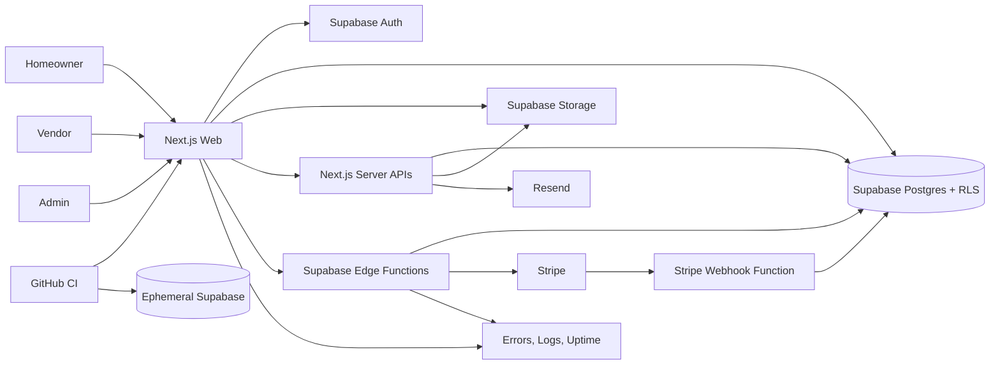

# Mercurius Technology Blueprint

**Blueprint version:** 1.0 audit baseline
**Repository baseline:** `94d608a` on `main`
**Status:** **APPROVED target architecture as of 2026-08-29; production activation remains blocked by the gates in `MTS-AUDIT.md`.**

## 1. Architecture objective

Preserve the working Next.js/Supabase marketplace and make it reproducible, payment-safe, testable, observable, and recoverable. The target is a modular monolith with managed services, not a premature microservice system.

The authoritative chain is:

`PRODUCT.md` → `DESIGN.md` → `matching.md` → this Technology Blueprint → implementation slices → automated evidence

Technology changes may not silently alter approved product, design, pricing, matching, role, or soft-launch rules.

## 2. Approved baseline and decisions

| Area | Target decision | Rationale |
|---|---|---|
| Web framework | Next.js 16 App Router, React 19, TypeScript strict | Already implemented and buildable; preserve current investment. |
| Runtime | One pinned, Vercel-supported Node LTS line | Eliminate local/CI drift; do not use an unpinned current release. |
| Package manager | npm with committed `package-lock.json` and `npm ci` | Existing lockfile is authoritative. |
| Hosting | Vercel with local, preview, and production environments | Natural fit for the current application and proxy/runtime model. |
| Identity/data/storage | Supabase Auth, Postgres, RLS, Storage, and Edge Functions | Already central to authorization, pricing, matching, and files. |
| Payments | Stripe Checkout and webhooks through Supabase Edge Functions | Preserve provider; harden idempotency and reconciliation. |
| Transactional email | Resend from server-only code | Existing owner notifications; add delivery and domain controls. |
| UI | Tailwind CSS 4, Base UI/shadcn-style primitives, existing MDS tokens | Preserve the implemented system and accessibility primitives. |
| Architecture style | Modular monolith plus database RPCs for transactional rules | Appropriate for present scale and team; avoids distributed-system overhead. |
| Testing | Vitest or Node test runner for units, Supabase SQL/RLS tests, Playwright + axe for E2E | Covers business logic, authorization, and user journeys. Final runner choice is an implementation ADR. |
| Observability | Structured logs, error monitoring, uptime checks, payment/reconciliation alerts | Required before real-customer activation. Provider selection remains an owner decision. |

## 3. System context



## 4. Trust boundaries

### Browser boundary

The browser may hold only public Supabase configuration and the user session. It may call Supabase directly only where RLS is the complete authorization boundary. Browser input and browser-calculated prices are never authoritative.

### Next.js server boundary

Next.js route handlers own public form validation, abuse controls, owner notifications, and issuance/finalization of signed upload grants. The Supabase service-role key is server-only and must be used through narrowly scoped service modules rather than general-purpose clients.

### Supabase database boundary

Postgres is authoritative for roles, service coverage, package eligibility, price snapshots, matching, job state, invoice state, and audit history. Security-definer functions must use fixed `search_path`, least privilege, explicit grants, and role-negative tests.

### Edge Function boundary

Checkout/refund functions require a validated Supabase user and explicit role/ownership checks. The Stripe webhook does not require Supabase JWT, but must require a valid Stripe signature. Function JWT settings must be committed.

### Provider boundary

Stripe and Resend responses are untrusted external outcomes. Every external mutation needs a durable local attempt record, stable idempotency key, timeout/retry rules, and reconciliation path.

## 5. Application module boundaries

Target source organization:

```text
src/
  app/                         # routes, layouts, route handlers
  components/                  # shared visual components
  features/
    auth/                      # login, recovery, redirect policy
    catalog/                   # services, packages, promotions
    requests/                  # plan builder and request workflow
    matching/                  # matching DTOs and UI adapters
    jobs/                      # lifecycle, photos, completion
    payments/                  # checkout client, invoice views
    messaging/                 # conversations and notifications
    vendor-onboarding/         # application and documents
    admin-operations/          # admin use cases
  server/
    env.ts                     # validated environment contract
    supabase/                  # server clients and generated types
    services/                  # narrow privileged use cases
    observability/             # logger, errors, correlation IDs
  lib/                         # small pure shared utilities
supabase/
  migrations/                 # complete, ordered source of schema truth
  functions/                  # Edge Functions and shared modules
  seed.sql                    # non-sensitive deterministic reference data
  tests/                      # SQL/RLS/transaction tests
tests/
  unit/
  integration/
  e2e/
mts/                           # audit, blueprint, roadmap, runbooks
```

Migration toward this structure must be incremental. Characterization tests come before extraction from large existing components.

## 6. Identity and authorization blueprint

### Roles

| Role | Primary capabilities | Enforcement |
|---|---|---|
| Anonymous | Marketing/catalog read, coverage lookup, contact/vendor application | Public policies plus API validation, rate limit, and Turnstile (at launch: honeypot, fill time, per-email and per-IP limits instead of Turnstile; see DEC-2026-013 and DEC-2026-014) |
| Homeowner | Own profile, requests, messages, photos, invoices, reviews | Authenticated RLS using `auth.uid()` and ownership joins |
| Vendor | Own contractor profile/packages, eligible offers, assigned jobs/messages/photos | Vendor role plus contractor ownership in RLS/RPCs |
| Admin | Operational queues, vendor approval, pricing, disputes, refunds | Admin role checked in proxy, RLS, RPC, and Edge Functions |
| Service role | Narrow server/Edge Function operations only | Never exposed to browser; use dedicated modules and audit logs |

### Required controls

- Preserve `auth.getUser()` token validation in the proxy.
- Protect homeowner routes server-side as well as admin/vendor routes; client-only redirects are not authorization.
- Generate a route-to-role matrix and test every protected route.
- Test every table/RPC/storage operation with anonymous, homeowner A/B, vendor A/B, admin, and service-role identities.
- Audit role grants on signup, vendor approval, suspension, and account deletion.
- Record admin security-sensitive actions with actor, target, before/after state, reason, request ID, and time.

## 7. Data blueprint

### Canonical domains

| Domain | Representative records | Invariants |
|---|---|---|
| Identity | profiles, user roles, contractors | One identity; explicit role grants; no client self-promotion |
| Catalog | services, packages, tiers, add-ons, promotions | Only active/reviewed packages expose fixed prices |
| Coverage | coverage areas, contractor service ZIPs | Public responses disclose only necessary coverage result |
| Requests/jobs | service requests, matches, status events, photos | State changes go through authorized transactional functions |
| Matching | job match attempts and price snapshots | At most one exclusive pending offer; deterministic retry-safe sequencing |
| Messaging | messages and notifications | Visible only to participants/admin; retention is explicit |
| Payments | checkout attempts, invoices, webhook events, disputes/refunds | Stripe IDs unique; ledger state auditable and reconcilable |
| Vendor onboarding | applications and credential documents | Private objects; expiring grants; retention/deletion policy |

### Migration contract

The repository must become the only schema source of truth:

1. Export the live schema without customer data or secrets.
2. Inventory every table, enum, sequence, index, function, trigger, policy, grant, extension, bucket, and hook.
3. Reconcile the export with committed migrations; never blindly overwrite production.
4. Create a reviewed baseline for new environments.
5. Retain forward-only migrations for every subsequent change.
6. Seed only deterministic non-sensitive reference data.
7. Generate TypeScript database types from the canonical schema.
8. Prove blank reset, upgrade from a production-like prior version, and restore from backup.

### Payment schema additions

Add a durable `checkout_attempts` model with at least:

- `id`, `service_request_id`, `customer_id`, `mode`, `amount_snapshot`, `currency`
- unique `business_key` and `stripe_idempotency_key`
- `invoice_id`, `stripe_session_id`, `status`, `failure_code`, `failure_detail`
- `created_at`, `updated_at`, `expires_at`, `completed_at`

Replace count-derived invoice numbers with a database sequence or another collision-safe immutable identifier.

Extend `stripe_webhook_events` with:

- `status` (`received`, `processing`, `processed`, `failed`, `dead_letter`)
- `attempt_count`, `last_error`, `received_at`, `processed_at`, `next_retry_at`
- event payload reference or safely retained payload, subject to privacy/retention policy

## 8. Integration manifest

| Integration | Purpose | Authentication | Required resilience | Owner action |
|---|---|---|---|---|
| Supabase Auth | Sessions and identities | Public key + user JWT | Auth lifecycle tests; redirect allowlist; session refresh | Configure URLs, email templates, MFA decision |
| Supabase Postgres | Product/operational truth | User JWT/RLS or service role | Migrations, RLS tests, backups, pool limits | Provide dev/preview/prod projects or branching policy |
| Supabase Storage | Vendor documents/job photos | Signed upload or user JWT/RLS | Size/type limits, cleanup, retention, backup | Confirm bucket privacy and retention |
| Supabase Edge Functions | Payments/refunds/webhook | JWT for user functions; Stripe signature for webhook | Versioned deploy, secrets, logs, replay | Configure function secrets and JWT settings |
| Stripe | Checkout, subscriptions, refunds, disputes | Secret key; signed webhooks | Idempotency, durable event processing, reconciliation | Configure test/live products, webhook, alert contacts |
| Resend | Owner notifications | Server API key | Timeout, failure logging, delivery monitoring | Verify sending domain, SPF, DKIM, DMARC |
| Vercel | Web hosting and preview promotion | Project/service account | Required checks, protected production, rollback | Configure project, domains, environments |
| Turnstile or equivalent | Public-form abuse control | Site key + server secret | Fail-safe policy and monitoring | Create site and approve privacy copy |
| Error/uptime provider | Application and Edge Function health | Server/client DSN or API | PII scrubbing, alert routing, release correlation | Select provider and recipients |

No live credentials belong in this manifest or repository.

## 9. Environment contract

Commit a secret-free `.env.example` and validate it with a typed schema. At minimum:

| Variable | Exposure | Environments | Owner |
|---|---|---|---|
| `NEXT_PUBLIC_SUPABASE_URL` | Browser-safe | local/preview/prod | Supabase/Vercel |
| `NEXT_PUBLIC_SUPABASE_ANON_KEY` | Browser-safe | local/preview/prod | Supabase/Vercel |
| `SUPABASE_SERVICE_ROLE_KEY` | Server secret | preview/prod; local only when needed | Supabase/Vercel |
| `NEXT_PUBLIC_SITE_URL` | Browser-safe | local/preview/prod | Vercel/Supabase functions |
| `STRIPE_SECRET_KEY` | Edge Function secret | test/live separated | Supabase |
| `STRIPE_WEBHOOK_SECRET` | Edge Function secret | test/live separated | Supabase |
| `RESEND_API_KEY` | Server secret | preview/prod | Vercel |
| `RESEND_FROM_EMAIL` | Server config | preview/prod | Vercel |
| `OWNER_NOTIFICATION_EMAIL` | Server config/PII | preview/prod | Vercel |
| `TURNSTILE_SECRET_KEY` | Server secret | preview/prod | Vercel |
| `NEXT_PUBLIC_TURNSTILE_SITE_KEY` | Browser-safe | preview/prod | Vercel |
| `MERCURIUS_INVITATION_MODE` | Edge Function config | unset everywhere except an armed environment | Supabase |
| `MERCURIUS_INVITATION_PROJECT_REF` | Edge Function config | hosted only, when armed | Supabase |
| `MERCURIUS_INVITATION_SITE_ORIGIN` | Edge Function config | hosted only, when armed | Supabase |
| Observability variables | Mixed | preview/prod | Vercel/Supabase |

Rules:

- Preview uses test Stripe and sanitized Supabase data.
- Production secrets are inaccessible to preview builds.
- Secret rotation procedures identify dependent deployments and webhook endpoints.
- Missing required values fail with one actionable message before route prerender or request handling.
- HMAC signing should use a dedicated versioned secret rather than reuse the Supabase service-role credential.
- Provider invitation dispatch stays off unless `MERCURIUS_INVITATION_MODE` is set, and in
  `hosted` mode the two pins must match the running `SUPABASE_URL` and `SITE_URL`, so a copied
  secret set or a preview deployment cannot invite real providers (TRACE-071).

## 10. Payment architecture

### Checkout command

1. Validate the authenticated homeowner and request ownership.
2. Lock/read the request and recompute package eligibility and price in Postgres.
3. Build a stable business key from request, checkout mode, price version, and customer.
4. Atomically create or obtain the existing checkout attempt and invoice.
5. Allocate invoice number from a database sequence.
6. Call Stripe with the attempt's stable idempotency key.
7. Persist the Stripe session ID and status; return an existing valid session on retry.
8. Reconcile attempts stuck between local creation and Stripe response.

### Webhook command

1. Verify Stripe signature from the raw body.
2. Upsert event as `received`; lock it for processing.
3. Perform required ledger/job/subscription mutations transactionally where possible.
4. Inspect every database `error` value and throw on critical failure.
5. Mark `processed` only after all required writes succeed.
6. Return non-2xx when safe retry is required.
7. Alert and expose replay for repeated failures.
8. Run scheduled reconciliation against Stripe for payments, refunds, disputes, and subscriptions.

## 11. Security architecture

### Preventive controls

- RLS and least-privilege function grants for all public schema objects
- Fixed `search_path` for security-definer functions
- Server-only service-role and provider secrets
- Schema validation for all public/API/Edge Function input
- Rate limit plus Turnstile for public writes and upload grants (at launch, the intake forms use a honeypot, fill time, and per-email and per-IP limits instead of Turnstile; see DEC-2026-013 and DEC-2026-014)
- File size/type checks, randomized paths, private buckets, retention, and malware-handling decision
- CSP, HSTS, frame protection, referrer policy, permissions policy, and MIME protection
- Dependency and secret scanning in CI
- Separate test/live Stripe and preview/production data

### Detective controls

- Structured JSON logs with request/correlation IDs
- Authentication/authorization failure metrics
- Public-form abuse and upload-volume alerts
- Stripe webhook lag/failure/dead-letter alerts
- Invoice/Stripe reconciliation exceptions
- Admin security audit trail
- Uptime checks for marketing, login, API health, and webhook health

### Recovery controls

- Point-in-time/database backup appropriate to the production plan
- Independent storage-object backup or documented recovery mechanism
- Restore drill with measured RPO/RTO
- Vercel rollback plus forward-fix database strategy
- Stripe webhook replay and ledger reconciliation procedures
- Secret compromise and rotation runbook

## 12. Delivery architecture

| Environment | Data | Providers | Promotion rule |
|---|---|---|---|
| Local | Seeded synthetic data | Supabase local; Stripe test; email sink/test | Developer-only |
| Preview | Sanitized isolated data | Supabase preview; Stripe test; Resend test/domain policy | Per pull request after CI |
| Staging (optional) | Production-shaped synthetic data | Non-live provider modes | Release-candidate verification |
| Production | Real data | Live Supabase/Stripe/Resend | Protected approval after all gates |

Required CI sequence:

```text
npm ci
→ lint application sources
→ typecheck
→ unit tests
→ clean Supabase reset + SQL/RLS tests
→ integration tests
→ production build
→ Playwright critical journeys + axe
→ dependency/secret scan
→ preview deployment
→ manual release approval
```

Database migration and application promotion must be coordinated. Destructive migrations require expand/migrate/contract staging and an explicit recovery plan.

## 13. Testing blueprint

### Unit

- Price, fee, payout, promotion, redirect, file, status, and identity helpers
- Matching score/tie-break logic where represented outside SQL
- Request validation and environment validation

### Database/RLS

- Complete role matrix for tables, storage, and RPCs
- Matching eligibility, exclusive-offer uniqueness, expiry, accept/decline, and concurrency
- Package/promotion timing and snapshot invariants
- Invoice sequence, checkout-attempt uniqueness, and webhook state transitions

### Integration

- Next.js API routes against ephemeral Supabase
- Stripe test-mode checkout/refund/dispute/subscription events
- Webhook duplicate, out-of-order, failed-write, and replay cases
- Signed upload expiry, path ownership, cleanup, and invalid file cases
- Resend failure/timeout behavior without losing the source submission

### E2E and accessibility

- Anonymous request and vendor application
- Homeowner signup/login/recovery/request/payment/status/photo/review
- Vendor login/offer/job/photo/package/profile
- Admin approval/matching/invoice/refund/dispute
- Keyboard navigation, focus, labels, dialogs, status semantics, and WCAG AA axe scans

## 14. Observability and service objectives

Initial private-beta objectives:

- Critical route availability target: 99.5% monthly
- Payment webhook processing: 99% within 5 minutes; no silent failed events
- Recovery point objective: 24 hours maximum until a stronger business requirement is approved
- Recovery time objective: 8 hours maximum until a stronger requirement is approved
- Public form abuse, payment reconciliation drift, and backup failure page an accountable owner

These are proposed technical baselines and require owner approval before becoming contractual promises.

## 15. Required architecture decisions

Record ADRs for:

1. Approved Node LTS and npm policy
2. Baseline migration strategy for the existing Supabase project
3. Payment checkout-attempt and invoice-number design
4. Webhook processing/replay model
5. Test runners and ephemeral Supabase strategy
6. Error monitoring and uptime provider
7. Turnstile/privacy behavior
8. File malware scanning, retention, and backup policy
9. Preview/staging/production environment topology
10. RPO/RTO and incident ownership

## 16. Definition of implementation-ready

The architecture is implementation-ready only when:

- the complete schema and policies can be recreated from source control;
- checkout and webhook processing are idempotent, durable, tested, and reconcilable;
- build-time type bypass is removed;
- all required environment names, owners, and deployment settings are documented;
- CI blocks regressions across lint, types, tests, schema, build, security, and E2E;
- public write paths have abuse controls;
- preview and production use isolated data and provider modes;
- monitoring, backup, restore, rollback, replay, and incident procedures are proven;
- all P0/P1 findings are closed or formally risk-accepted by an accountable owner.


## Approved staged-release architecture addendum — 2026-09-28

Under DEC-2026-022, R0 may publish the rebuilt app for recruiting only after its own hosted acceptance and owner go/no-go. The database is the authoritative, default-closed homeowner admission boundary for new request creation, with checkout refusing an unadmitted source as defense in depth. Client navigation and a `NEXT_PUBLIC_` flag cannot authorize transactions. Grants and revocations require actor, time and service/area scope; historical transactions remain accessible. R0 interest, consent, Auth linkage, withdrawal, suppression and observable retention use least-privilege data boundaries. Invitation email and owner-application notification are separate delivery paths.

Preview remains isolated. Hosted migration rehearsal, coordinated deployment, monitoring and rollback precede public exposure. The existing transactional, money, recovery and security gates remain mandatory for R1. No production schema, email, domain or transaction activation follows merely from merging code.
